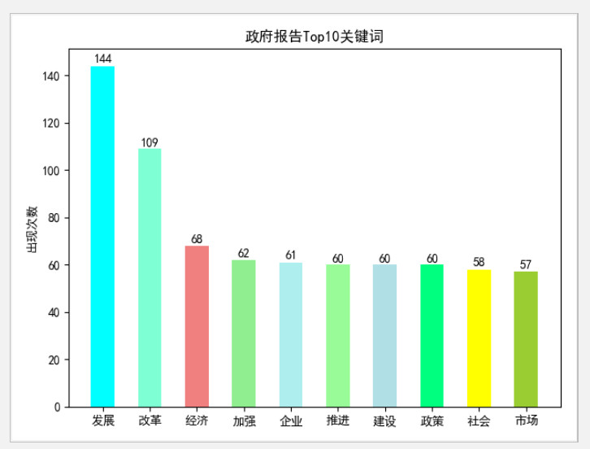
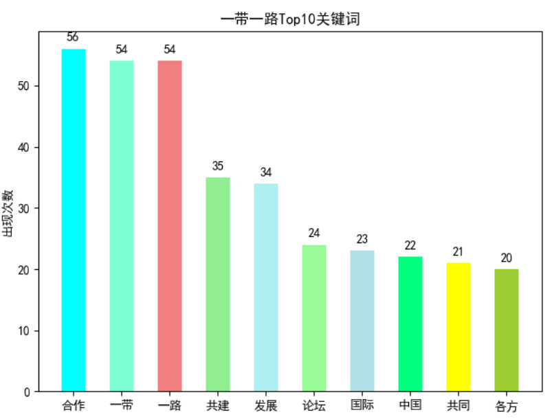

python demo.

分词实例说明详见Python分析3月政府工作报告.md文档；

需要安装的字体文件由于太大请自行网上搜索；

运行项目需要自行通过pip安装jieba，BeautifulSoup,matplotlib等库，相信这个只是小问题啦~

掘金专栏主页：https://juejin.im/user/5c9b94ac6fb9a070e82c23b3/posts

**词云分词效果：**

**jeiba分词matplotlib显示Top10：**

